<div align="center">

# ProxiMight

**A per-application proxifier for Windows.**
Force any app's traffic through the SOCKS/HTTP proxies **you** choose — decided by
rules you write, per profile — behind a kill-switch designed to fail closed.

*C11 core. Dear ImGui front-end. Chain-link by design.*

[](docs/ROADMAP.md)
[](SECURITY.md)
[](docs/SETUP-WINDIVERT.md)
[](tests)
[](LICENSE)

<br>

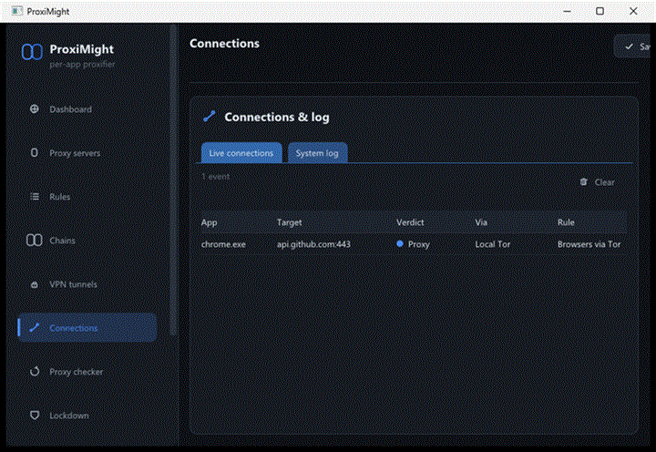

<sub>Every connection, attributed to its app and resolved live — <b>Proxy</b> (single or via a chain), <b>Direct</b>, or <b>Block</b>.</sub>

</div>

---

> ### Read this before anything else
>
> ProxiMight **sees** and **blocks** real per-application connections today. It does
> **not** yet have a verified ability to **redirect** them to a proxy — that code
> path is written, unit-tested and reviewed, but **no packet has ever been observed
> going through it**. `caps.real` is `false`, the UI says so on every screen, and a
> `Proxy` verdict deliberately **fails closed** rather than leaking out unproxied.
>
> It is unaudited pre-alpha. If a traffic leak would harm you, **wait**.

---

## Contents

- [What it is](#what-it-is) · [What's real, precisely](#whats-real-precisely)
- [The interface](#the-interface) — [Dashboard](#dashboard) · [Connections](#connections) · [Rules](#rules) · [Proxies](#proxy-servers) · [Chains](#proxy-chains) · [Checker](#proxy-checker--network-path) · [VPN](#vpn-tunnels) · [Lockdown](#lockdown--the-kill-switch) · [Settings](#settings)
- [How it works](#how-it-works) · [Build](#build) · [Real traffic](#seeing-real-traffic)
- [Security posture](#security-posture) · [Layout](#layout) · [Roadmap](#roadmap) · [License](#license)

---

## What it is

An open re-imagining of [Proxifier](https://www.proxifier.com/): a desktop utility
that forces network applications — even ones with no proxy support of their own —
through proxies chosen by **per-profile rules**.

| | |
|---|---|
| **Proxy servers** | HTTP CONNECT, SOCKS4, SOCKS4a, SOCKS5, with per-server auth. *HTTPS-to-proxy is declared but returns `UNSUPPORTED` — it needs a TLS library.* |
| **Rules** | Match on application, target host and port. Ordered, **first match wins**, with a Default rule. Drag to reorder. Act `Proxy` / `Direct` / `Block`. |
| **Chains** | **Sequential** chains tunnel hop by hop, each handshake riding *inside* the tunnel the previous hop established. **Redundancy** chains are a set of alternatives — today only the first is used. |
| **Checker** | Reachability, proxy handshake, latency, ICMP ping, optional egress IP, and per-hop checks for every chain. |
| **Network path** | MTR-style traceroute with per-hop loss / best / avg / worst. **No Administrator required.** |
| **VPN tunnels** | Import OpenVPN `.ovpn` and WireGuard `.conf` as the overarching tunnel. ProxiMight reads them to allowlist the endpoint in lockdown — it **never copies your keys**. |
| **Lockdown** | A fail-closed kill switch: if the proxy path dies, everything else is blocked. Per-profile policy, hysteresis, DNS and IPv6 leak guards. |
| **Profiles** | Everything above saves to a `.pmxprofile`, **sealed at rest** with DPAPI on Windows so proxy credentials never touch disk in cleartext. |

> **This tool does not add encryption.** A proxy is not a VPN. ProxiMight steers
> traffic to proxies you configure; the privacy you get is the privacy those
> proxies provide. See [`docs/PRIVACY-SECURITY.md`](docs/PRIVACY-SECURITY.md).

## What's real, precisely

The honest ledger. "Real" means it has been *observed* working, not merely written.

| Capability | State | Notes |
|---|:--:|---|
| Per-app attribution | ✅ **real** | Exact owning PID from WinDivert's socket layer, image name via the TCP table |
| **Blocking** | ✅ **real** | A `Block` rule drops the connect; the app sees it fail |
| Rule / chain / lockdown engine | ✅ **real** | Unit-tested; drives every backend identically |
| Proxy protocol clients | ✅ **real** | SOCKS5 verified end-to-end over a real socket; a two-hop chain proven through two real SOCKS5 servers |
| Ping + MTR | ✅ **real** | Verified against a live 6-hop trace with a 100 %-loss hop flagged |
| VPN config ingestion | ✅ **real** | Both parsers tested, including config-injection resistance |
| Profile sealed at rest | ✅ **real** | DPAPI; legacy plaintext migrates on first load |
| **Proxy redirection** | 🔴 **written, unproven** | The NAT-to-relay rewrite has never been observed on the wire. Fails closed. |
| **Kill-switch enforcement** | 🔴 **stub** | Lockdown logs precisely what it *would* block. Real WFP filters are next. |
| Failover | 🔴 **not built** | Redundancy chains use hop 0 without checking health; "fail to backup" blocks like fail-closed |
| HTTPS-to-proxy · IPv6 · UDP | 🔴 **refused** | Returned as `UNSUPPORTED` or failed closed rather than approximated |
| macOS | ⚪ **scaffolding** | Never compiled |

---

## The interface

Nine panels, light and dark themes, DPI-aware, custom chain-link iconography, and a
native title bar tinted to match. All shots below are the current build on the
built-in simulated backend, so everything here runs with **no driver installed**.

### Dashboard

Live counters, engine state, and the honesty banner that never goes away while
redirection is unproven.

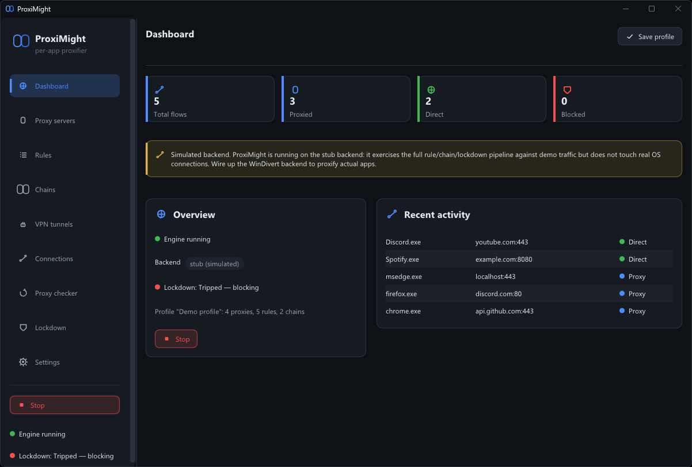

### Connections

Every connection as it happens: the owning application, where it was going, and the
verdict your rules produced.

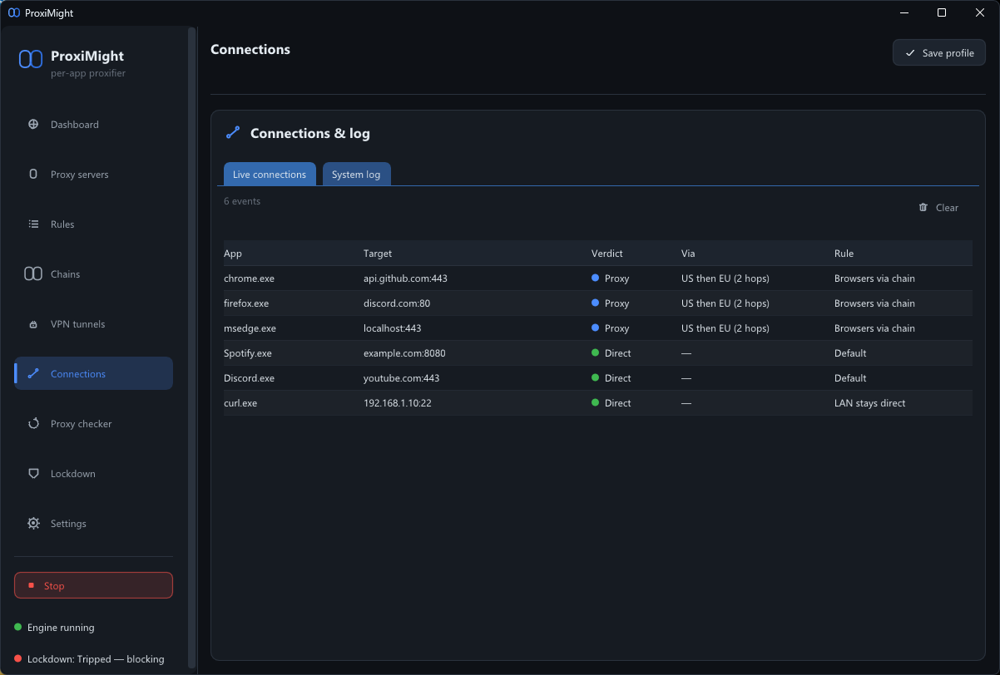

### Rules

The heart of it. Ordered, first-match-wins, drag the handle to reorder. Match by
application, host pattern and port spec; act `Proxy`, `Direct` or `Block`. A `Proxy`
rule targets either a single proxy or a whole chain.

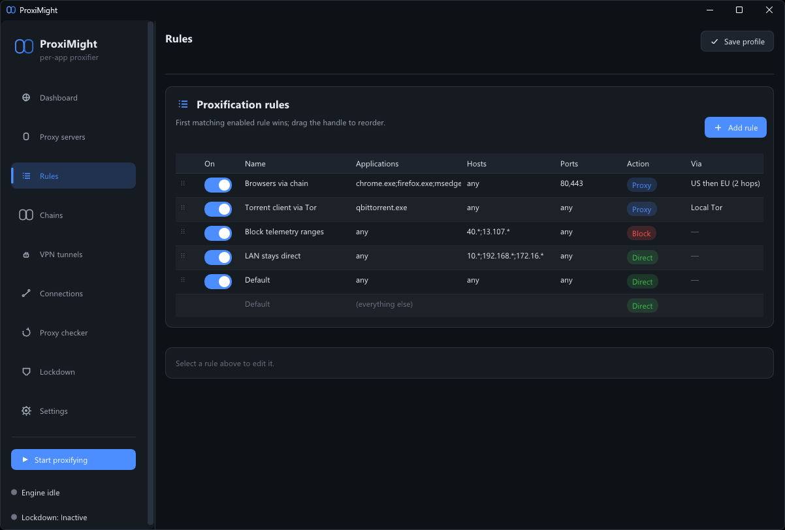

> **Host-*name* patterns cannot match on the WinDivert backend.** The OS hands it a
> numeric address — the application already resolved the name — so `*.example.com`
> never fires. ProxiMight **warns you per rule** instead of failing silently. Use IP
> patterns there.

### Proxy servers

SOCKS4/4a/5 and HTTP CONNECT, per-server credentials, and a one-click Test that
reports reachability, handshake and latency.

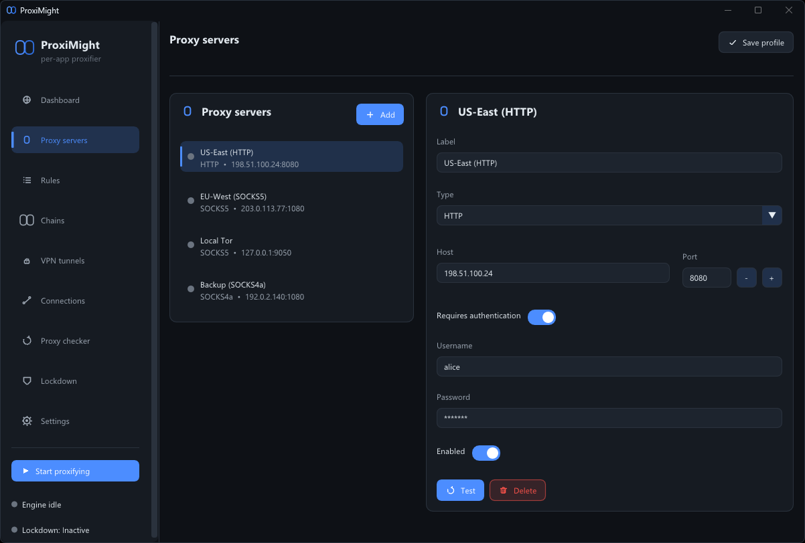

### Proxy chains

Route through several proxies in sequence — each handshake performed *inside* the
tunnel the previous hop established, which is what makes a chain a chain rather
than a list. Reorder or remove hops freely.

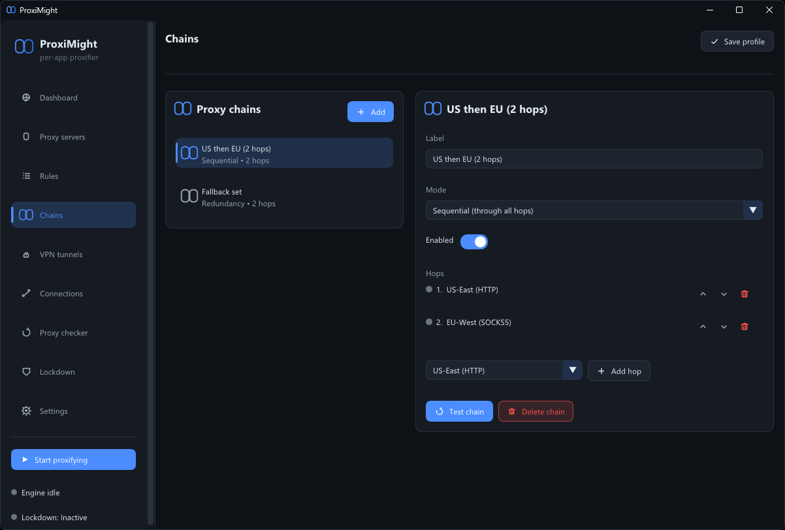

> Chain resolution is **all or nothing**. If any hop is missing or disabled the flow
> fails closed rather than going out through fewer hops than you asked for —
> under-proxying misrepresents your protection, which is worse than not proxying.

### Proxy checker & network path

Reachability, handshake cost, latency and ICMP ping side by side — plus an MTR-style
path with per-hop loss, so you can see *where* a route degrades. No admin needed.

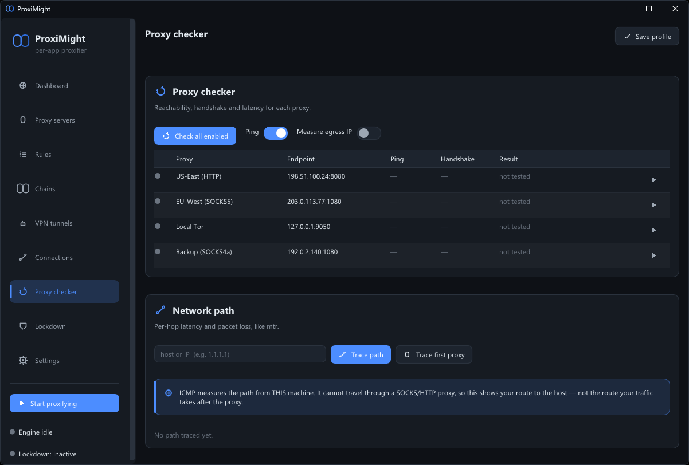

> ICMP and traceroute leave your machine **directly** — they cannot traverse a
> proxy. A clean hop list is a diagnostic, never proof that your traffic is private.
> The UI says so.

### VPN tunnels

Import an OpenVPN `.ovpn` or WireGuard `.conf` as the overarching tunnel your proxy
rules ride inside. ProxiMight parses endpoints, DNS, MTU and routing to allowlist
the tunnel in lockdown, and can start and stop the **vendor client** for you.

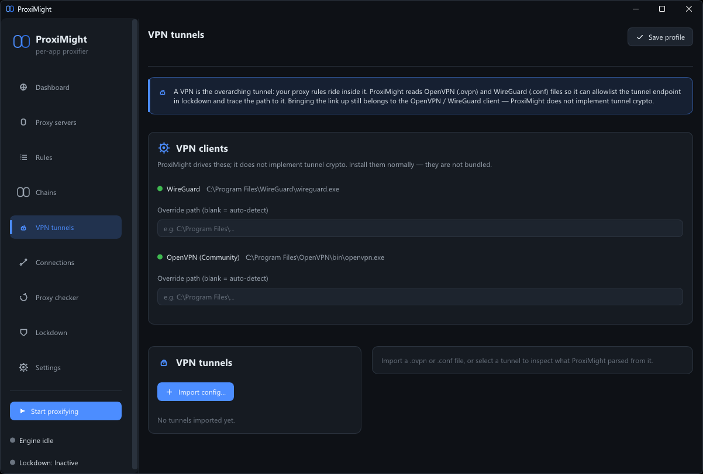

> **Key material is never copied.** The parser records only *that* a `PrivateKey`,
> `PresharedKey` or inline `<key>` block is present, plus the path to your original
> file — which is what gets handed to the vendor client. A test byte-scans the
> parsed struct to prove no secret ever enters it.

### Lockdown — the kill switch

A fail-closed posture: while armed, only the proxy endpoints and loopback may leave
the machine. If the proxy path goes unhealthy, everything else is blocked so nothing
leaks direct. Hysteresis stops it flapping.

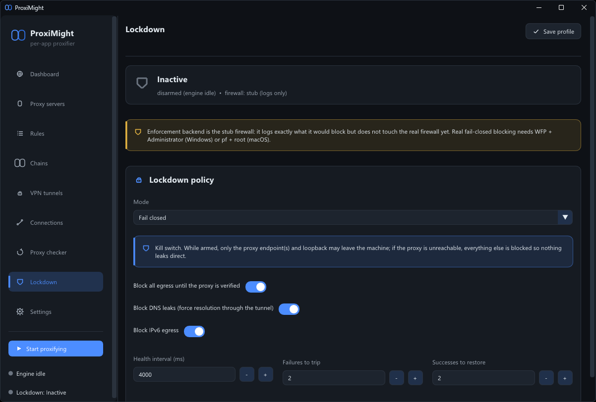

> 🔴 **Enforcement is still the stub firewall** — it logs exactly what it *would*
> block and the panel states this plainly. Real blocking needs WFP plus
> Administrator on Windows, or `pf` plus root on macOS.

### Settings

Profile management, the demo-traffic generator, checker defaults, backend selection
and the vendor VPN client paths.

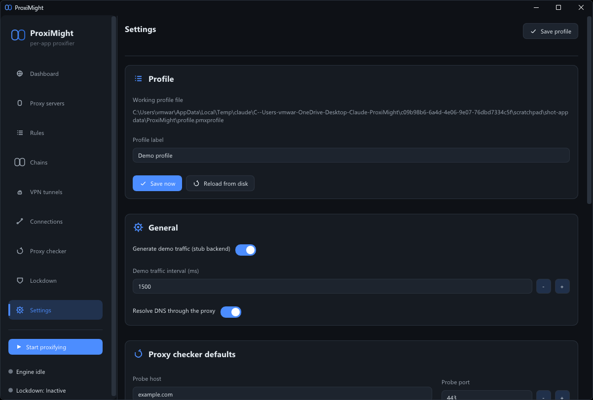

---

## How it works

Two layers. The **engine** is portable C with no UI and no platform assumptions; the
**backend** is a swappable implementation of how traffic is actually intercepted.

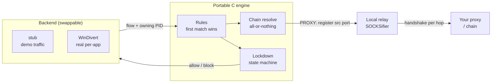

A proxied connection, end to end:

1. The **socket layer** sees a connect and its owning PID. The engine resolves a
   verdict from a lock-free snapshot of your profile.
2. On `PROXY`, the flow's source port is registered with the **relay** and the **NAT
   table** *before* the SYN is allowed out. If either registration fails, the
   connection is **blocked** — never allowed out unproxied.
3. The **network layer** rewrites the flow so both endpoints are loopback, and
   rewrites replies back so the application still believes it reached the real host.
   Checksums are recomputed.
4. The **relay** accepts, walks the chain — each hop's handshake inside the previous
   hop's tunnel — and splices bytes.

The capture filter is scoped so ProxiMight can never recapture packets it injects,
and the socket layer skips its own process so the relay's upstream connection can't
be recursively proxied into itself.

**Threading** is deliberately simple: backends push flows into a bounded, mutex-guarded
inbox; one pump drains it per frame, so the live profile needs no locks. For verdicts
a backend needs *now*, the engine republishes an immutable snapshot each pump.

More depth: [`docs/ARCHITECTURE.md`](docs/ARCHITECTURE.md).

---

## Build

You need a C / C++17 toolchain, **CMake ≥ 3.24**, and internet on the first configure
so CMake can fetch GLFW, Dear ImGui + cimgui, and cJSON. All three are pinned to an
exact tag or commit, so a clean configure builds the same thing tomorrow.

**Windows** — Visual Studio 2022 with *Desktop development with C++*:

```bash
tools/build.ps1
```

```bash
tools/run.ps1
```

The script finds VS, enters its developer environment, and configures with the
VS-bundled CMake + Ninja. Manual builds work from a *Developer PowerShell for VS 2022*:

```bash
cmake --preset windows-debug && cmake --build --preset windows-debug && ctest --preset windows-debug
```

Before tagging, build with warnings as errors — the tree is clean at `/W4 /WX`:

```bash
cmake -S . -B build/werror -G Ninja -DPMX_WERROR=ON && cmake --build build/werror
```

> **Clone somewhere short.** Windows' 260-character path limit bites during
> dependency fetch — `C:\src\ProxiMight` is always safe. Full details and macOS in
> [`docs/BUILD.md`](docs/BUILD.md).

### Tests

```bash
tools/test.ps1
```

14 CTest suites, passing in **both Debug and Release**. They cover the protocol
codecs byte by byte, a real SOCKS5 round trip over a socket, a genuine two-hop chain
through two live proxy servers, the NAT table's fail-closed semantics, the lockdown
state machine including engage-failure branches, profile sealing and migration, and
config-injection resistance in the VPN parsers.

---

## Seeing real traffic

Out of the box ProxiMight runs on a **stub backend** — the full rule, chain and
lockdown pipeline against generated traffic, so the whole app is usable and testable
with no driver at all.

For real per-application connections, supply the **WinDivert** SDK yourself —
[github.com/basil00/WinDivert](https://github.com/basil00/WinDivert)
([releases](https://github.com/basil00/WinDivert/releases), grab the **2.2.x x64**
zip). It is deliberately **not bundled**: it is a signed kernel driver under
LGPLv3/GPLv3, and you should download and signature-verify your own copy so the
trust chain stays yours.

Drop it in either layout — both are recognised — then rebuild:

```
third_party/windivert/windivert.h + WinDivert.lib + WinDivert.dll + WinDivert64.sys
third_party/windivert/include/windivert.h + x64/WinDivert.{lib,dll} + x64/WinDivert64.sys
```

Elsewhere is fine too, as long as you point CMake at the **extracted root** (the
folder containing `include/` and `x64/`, not `x64/` itself):

```bash
cmake --preset windows-release -DPMX_WINDIVERT_DIR="C:/path/to/WinDivert-2.2.2-A"
```

Confirm `-- WinDivert SDK found -> real per-app monitoring enabled` in the CMake
output, and remember it **caches a failed search** — after moving files, re-run
with `-U WINDIVERT_INCLUDE_DIR -U WINDIVERT_LIBRARY`. Then run elevated. Full
procedure, verification and a low-risk live test:
[`docs/SETUP-WINDIVERT.md`](docs/SETUP-WINDIVERT.md).

> ⚠️ On a current Windows 11 machine, **Memory Integrity and the vulnerable-driver
> blocklist will refuse to load WinDivert**. The real backend may be unavailable
> without relaxing that — a deliberate security trade-off you should make knowingly.

---

## Security posture

The profile is sealed at rest, and the engine has been through several adversarial
review passes — one of which audited the previous one's diff and caught a regression
it had introduced. Those passes found and fixed real defects: a kill switch that
silently stopped engaging after a mode change; config injection through unrecognized
`.ovpn` inline blocks feeding the kill-switch allowlist; a Winsock refcount race; a
NAT table that dropped a live flow's mapping; UDP allowed out while the log claimed
it was proxied; and several places the UI claimed protection it was not providing.

**None of that is an external audit.** No independent reviewer has looked at this.

Known weaknesses are documented rather than hidden — host-name rules being
unenforceable on WinDivert, OpenVPN's unauthenticated management socket, the stub
firewall, and the one question about the redirect path that reading the source
cannot settle. All of them, with reasoning, are in
[`docs/PRIVACY-SECURITY.md`](docs/PRIVACY-SECURITY.md). Reporting:
[`SECURITY.md`](SECURITY.md).

---

## Layout

```
include/proximight/   Public C headers — the module contracts
src/core/             Portable C engine: rules, chains, proxies, checker,
                      netpath, lockdown, relay, NAT, VPN, profile, sealing
src/backend/          Swappable interception backends (stub / windows / macos)
src/gui/              Dear ImGui front-end; one thin C++ GLFW/OpenGL shim
tests/                14 CTest suites for the core
docs/                 Architecture, build, roadmap, privacy, setup, releasing
cmake/                Pinned dependency fetching + warning configuration
tools/                build.ps1 / run.ps1 / test.ps1
```

## Roadmap

Next, in order: **confirm the packet rewrite on an elevated run** and flip
`caps.real`; **real WFP kill-switch enforcement**; IPv6 and UDP in the redirect path;
health-driven failover; TLS for HTTPS proxies; then macOS via `pf` + `utun`.

Full phase-by-phase state, including everything deliberately *not* done:
[`docs/ROADMAP.md`](docs/ROADMAP.md).

**Non-goals:** bundling any driver or Tor binary, shipping our own kernel driver, and
presenting ProxiMight as a VPN or as production-safe before a real review.

## License

**MIT** for ProxiMight's own code — see [`LICENSE`](LICENSE).

Third-party dependencies keep their own licenses. **WinDivert is LGPLv3/GPLv3** and
is *not* bundled; read [`docs/RELEASING.md`](docs/RELEASING.md) before you ship a
binary that carries a driver alongside it.
